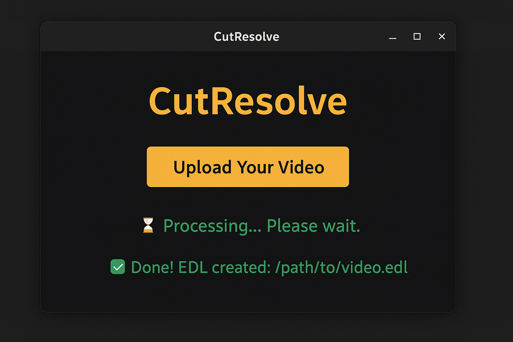

<<<<<<< HEAD
# 🎬 CutResolve  

  

[](https://www.python.org/)  
[](./LICENSE)  
[](https://github.com/vincentilagan/cutresolve)  

---

👨‍💻 **Developed by Vincent Ilagan**  

---

## ✨ WHAT IS CUTRESOLVE?  

**CUTRESOLVE** is a lightweight desktop app built with **Python** that analyzes your video, detects every **SCENE CHANGE**, and automatically generates an **EDL (EDIT DECISION LIST)** file.  

You can import the EDL straight into **DAVINCI RESOLVE STUDIO** to get a timeline with cuts already in place.  

This tool is designed for editors who want to **SKIP MANUAL SCENE DETECTION** and dive straight into **COLOR GRADING, VFX, OR TIMELINE ASSEMBLY**.  

---

## 🔑 KEY FEATURES  

✅ Detects **SCENE CUTS** in MP4 videos with adjustable sensitivity  
✅ Exports an **EDL FILE** compatible with DaVinci Resolve  
✅ Instantly builds a cut timeline without scrubbing frame by frame  
✅ Clean, **MINIMAL INTERFACE** with progress updates  
✅ Works **OFFLINE** — no internet connection required  
✅ Saves output **ALONGSIDE YOUR SOURCE VIDEO** for convenience  

---

## 🚀 GETTING STARTED  

1️⃣ Launch `CutResolve.py`.  
2️⃣ Click **UPLOAD YOUR VIDEO** and select an MP4 file.  
3️⃣ The app will analyze your footage — a **status message** keeps you updated.  
4️⃣ Once done, an `.edl` file is created in the **SAME FOLDER** as your video.  
5️⃣ In **DaVinci Resolve**, go to `File > Import > Timeline` and select the **EDL**.  
6️⃣ Your video will appear in a **NEW TIMELINE**, already cut at each detected scene.  

💡 **PRO TIP:** Combine CutResolve with **Resolve’s Color Management** to grade each scene individually without the pain of manual splitting.  

---

## 🖼️ SAMPLE INTERFACE  

Here’s what the GUI looks like when running CutResolve:  

  

- 🎥 **Upload Your Video** → Choose the footage you want to process  
- ⏳ **Processing Indicator** → See when the tool is analyzing your file  
- ✅ **Completion Message** → Confirms the `.edl` file is ready for import  

---

## 💻 COMMAND LINE USAGE (OPTIONAL)  

```bash
python CutResolve.py
=======
# cutresolve
CutResolve is a lightweight desktop app built with Python that analyzes your video, detects every scene change, and automatically generates an EDL (Edit Decision List) file. You can import the EDL straight into DaVinci Resolve Studio to get a timeline with cuts already in place.
>>>>>>> 2762dea5a12881068ddc4ecd1b63845e2449c5b9
